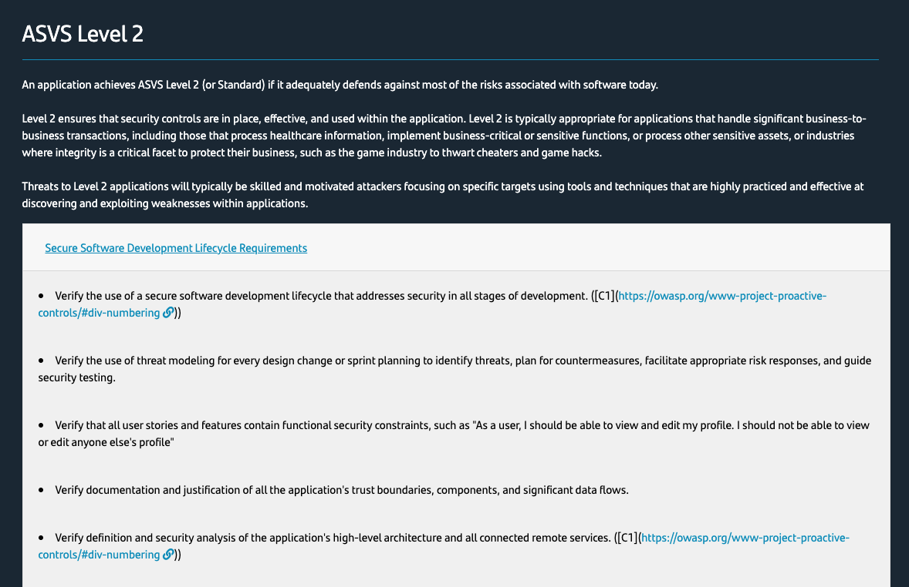
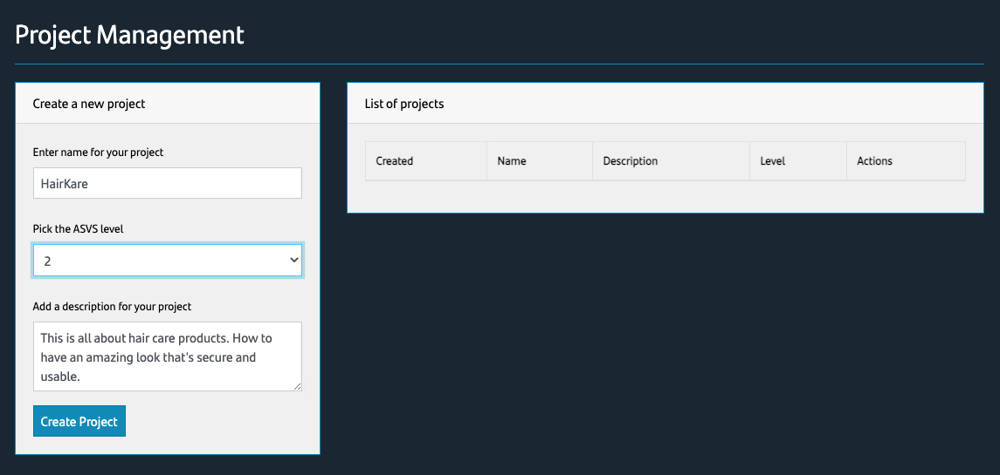
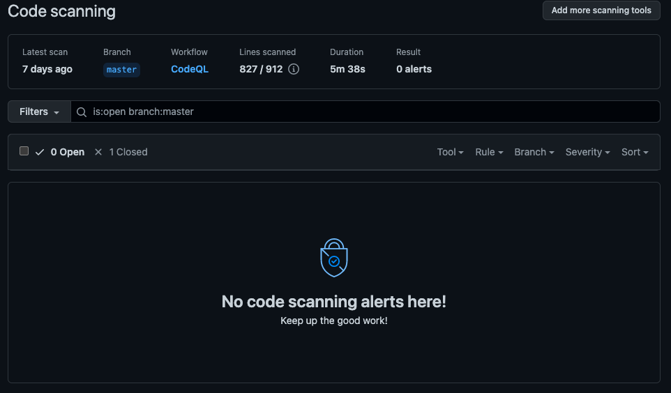

# Welcome To The OWASP Application Security Verification Standard (ASVS) Web App - Release Name: **SCANROUTE**

The OWASP Application Security Verification Standard [ASVS](https://owasp.org/www-project-application-security-verification-standard/]) is a community-effort to
establish a framework of security requirements and controls that focus on normalising the functional and non-functional security controls required when designing, developing and testing modern web applications.

You can access the ASVS via [Github](https://github.com/OWASP/ASVS/tree/v4.0.2/4.0), but we wanted to make this more accessible to all as a web application (based on django). The key aim of the web application is to allow individuals or companies a quick and easy way to understand the ASVS controls, and where to find information on meeting those controls. For this second release, we've also added 2FA authentication so as to offer more security for sensitive projects. 

When we built Marbles (the original release), our aim was the following:

 - [x] Easy to update - the app is powered by two JSON files (asvs.json & category.json)
 - [X] Lightweight -  The included Dockerfile builds a 89MB Docker image (size isn't everything)
 - [X] No frills - You don't want a web app that takes ages to load and has "extra" stuff in it
 - [X] Community-focused - The ASVS is built by you for you, and so should this application. We welcome pull requests and ideas from you, the community.

## Installing

We decided to use Docker for virtualisation so that it's easier to run in the cloud and keep update. This assumes you have Docker installed and running on your host (be it on-prem or cloud)

### Docker
Once you have cloned the repo, you can build and run the docker image with the following commands:

`docker build -t asvs .`  
`docker run -d -p 8000:8000 asvs`  

This will then map your local port 8000 to the running docker container.

**NOTE:** In this example we built the docker image using the tag (-t) *asvs*, however you can change this if you want.

***In asvs/settings.py, you will find the SECURITY_KEY. We cannot stress this enough, this should be changed before you deploy this yourself.*** 

### Other
If you want to run the web app on a "production" grade web server (such as Apache2) you can, django provides a WSGI file which you can find in the *asvs* folder. Individual installation guides for this are outside of the scope of this project, however because sharing is caring here is a [link](https://docs.djangoproject.com/en/2.0/howto/deployment/wsgi/) to the official django documentation.

## Roadmap

This is the second release and we already have some new "features" in the planning stages. These are currently (and subject to change).

1. Sharing projects between individuals
2. Teams (maybe)
3. Integration into JIRA (via an API)

## Screenshots

## Code Security

It would be pretty silly if an app about application security made use of insecure code and infrastructure. As such, we are pretty strict about this and make use of both [CodeQL](https://codeql.github.com/), a brilliant semantic code analysis engine from GitHub, [Semgrep](https://semgrep.dev/), a super fast static analysis tool as well as [Snyk's](https://snyk.io/learn/docker-security-scanning/) Docker scan. 

Once code is committed, we make use of GitHub's Actions to run futher security tests

## Who Are We?

Adam Maxwell (@catalyst256) & Daniel Cuthbert (@dcuthbert) are part of the Santander Group Cyber Security Research Team. Daniel is one of the co-authors of the ASVS, and we use it within the group and felt this app would be better suited as a community release, rather than just another internal tool. We've also had @[rubeniglesiasg](https://github.com/Santandersecurityresearch/asvs/commits?author=rubeniglesiasg) help us with slinging code, and getting it ready for version two dot oh. 

